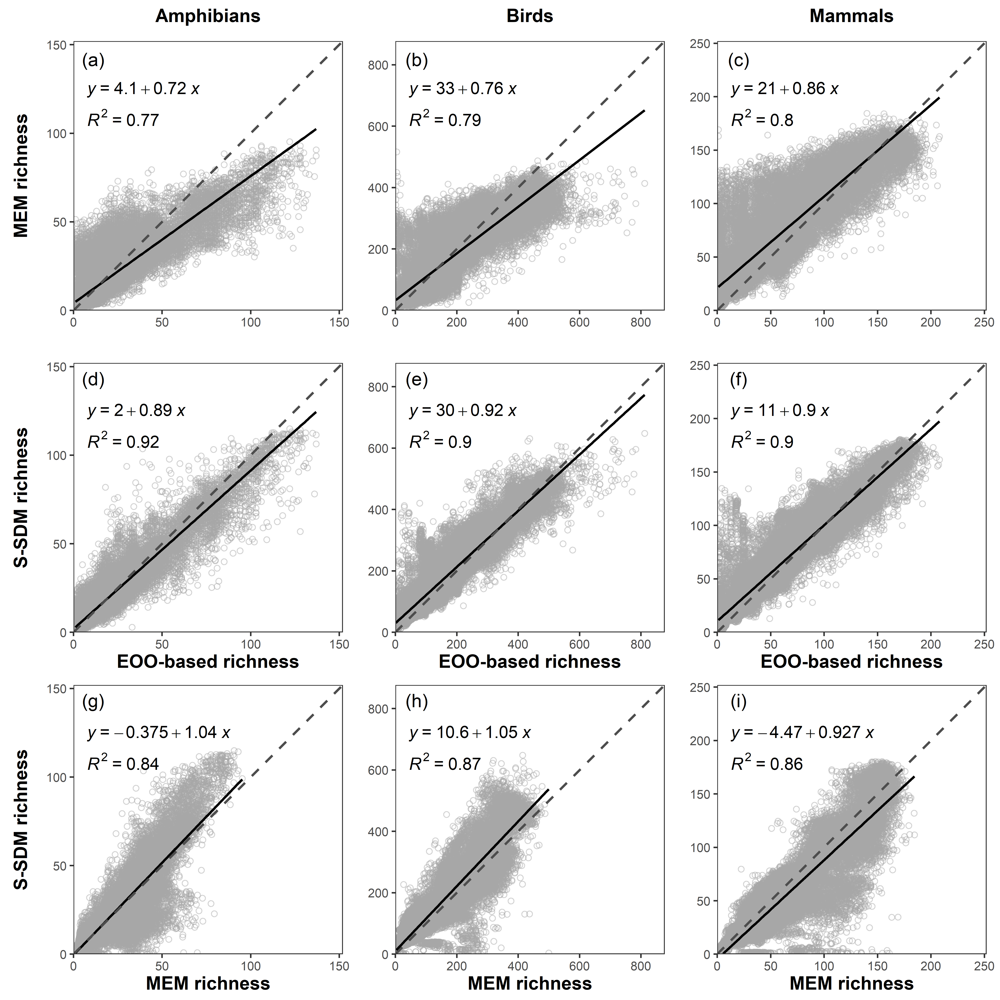
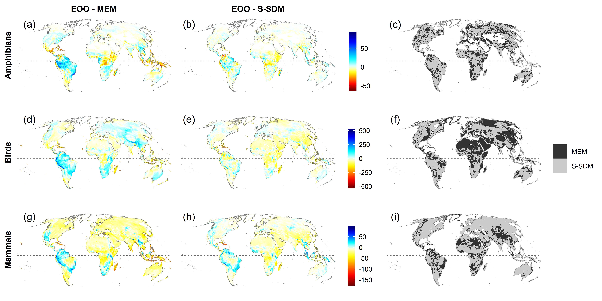
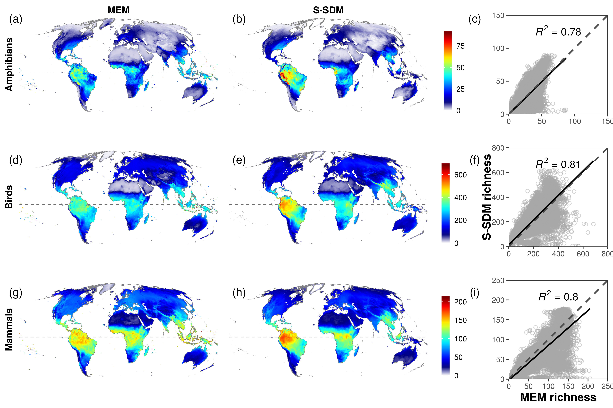
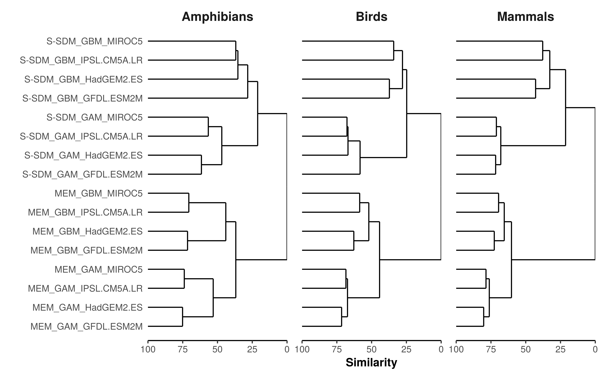

**Running title:** Species richness predictions

^1^Biodiversity & Global Change Lab, Terrestrial Ecology Research Group, Technical University of Munich, Germany

^2^Senckenberg Biodiversity and Climate Research Centre, Senckenberganlage 25, D-60325 Frankfurt, Germany

^3^Department of Physical Geography, Geosciences, Johann Wolfgang Goethe University of Frankfurt, Altenhöferallee 1, 60438 Frankfurt am Main, Germany

**Correspondence:** Matthias F. Biber, Technical University of Munich, Hans-Carl-von Carlowitz-Platz 2, D-85354 Freising, Germany, E-mail: matthias.biber@tum.de

# Acknowledgements

We thank the Inter-Sectoral Impact Model Intercomparison Project (ISIMIP) and especially L. Warszawski, C. Reyer, S. Lange and K. Frieler, as well as everyone else involved in generating the EWEMBI and ISIMIP2b climate data, for their support and making the data available. This work was supported by the German Federal Ministry of Education and Research (FKZ 01LS1617A). We also acknowledge support by the Bavarian Ministry of Science via the Bavarian Climate Research Network (bayklif) (M.F.B. and C.H.) and by the German Young Academy (Die Junge Akademie) (C.H.).

# Data accessibility

IUCN range maps are available from https://www.iucnredlist.org/resources/spatial-data-download and BirdLife range maps from http://datazone.birdlife.org/species/requestdis. EWEMBI and ISIMIP2b climate data are available from https://esg.pik-potsdam.de/search/isimip/?product=input. The model output of the SDMs and MEMs is publicly available as part of the Terrestrial Biodiversity Sector of ISIMIP (https://esg.pik-potsdam.de/search/isimip/?sector=Terrestrial_Biodiversity). The code for the SDMs can be found at https://github.com/chof/BioScen1.5_SDM, while the code for the macroecological models, the uncertainty analysis and the provided figures, can be found at https://github.com/chof/BioScen1.5_MEM.

\newpage

# Abstract  

**Aim:** Predicting future changes in species richness in response to climate change is one of the key challenges in biogeography and conservation ecology. Stacked species distribution models (S-SDMs) are a commonly used tool to predict current and future species richness. Macroecological models (MEMs), regression models with species richness as response variable, are a less computationally intensive alternative to S-SDMs. Here, we aim to compare the results of two model types (S-SDMS and MEMs), for the first time for more than 14,000 species across multiple taxa globally, and to trace the uncertainty in future predictions back to the input data and modelling approach used.

**Location:** Global land, excluding Antarctica.

**Taxon:** Amphibians, birds and mammals.

**Methods:** We fitted S-SDMs and MEMs using a consistent set of bioclimatic variables and model algorithms and conducted species richness predictions under current and future conditions. For the latter, we used four general circulation models (GCMs) under two representative concentration pathways (RCP2.6 and RCP6.0). Predicted species richness was compared between S-SDMs and MEMs and for current conditions also to extent-of-occurrence (EOO) species richness patterns. For future predictions, we quantified the variance in predicted species richness patterns explained by the choice of model type, model algorithm and GCM using hierarchical cluster analysis and variance partitioning.

**Results:** Under current conditions, species richness predictions from MEMs and S-SDMs were strongly correlated with EOO-based species richness. However, both model types over-predicted areas with low and under-predicted areas with high species richness. Outputs from MEMs and S-SDMs were also highly correlated among each other under current and future conditions. The variance between future predictions was mostly explained by model type.

**Main conclusions:** Both model types seem were able to reproduce EOO-based patterns in global terrestrial vertebrate richness, but produce less collinear predictions of future species richness. Model type by far contributes to most of the variation in the different future species richness predictions, indicating that the two model types should not be used interchangeably. Nevertheless, both model types have their justification, as MEMs can also include species with a restricted range, while S-SDMs are useful for looking at potential species-specific responses.

**Keywords:** biodiversity, climate change, cluster analysis, macroecological model, richness model, species distribution model, species richness, variance partitioning, terrestrial vertebrates

\newpage

# Introduction

One of the current major challenges in biogeography is to understand and predict the potential impacts of global change on the distribution of biological diversity. In addition to land-use change and its consequences for natural habitats, climate change has been identified as one of the most prominent drivers of biodiversity change (Sala et al., 2000; IPBES, 2019). Changes in biological systems in response to climate change are frequently documented, including shifts in species distribution (Chen, Hill, Ohlemüller, Roy & Thomas, 2011). Such changes in species distributions ultimately result in changes of biodiversity patterns, such as the geographical variation of species richness.

Species richness is a simple albeit important measure for biodiversity and has been identified as one of the Essential biodiversity variables (EBVs) (Pereira et al., 2013). EBVs function as an interface between raw data and indicators and are meant to provide robust and coordinated data about biodiversity change on a global scale in order to inform policy makers (Brummitt et al., 2017; Geijzendorffer et al., 2016). EBVs require representative sampling across taxonomic groups especially for assessing changes in ecosystem services. Field studies and monitoring schemes provide data for a wide range of EBVs, but are often limited in spatial or temporal coverage, whilst large-scale data sources, such as the Global Biodiversity Information Facility (GBIF), are inherently biased (Meyer, Kreft, Guralnick & Jetz, 2015) and not representativeness on a global scale (Proença et al., 2017).

Global climate models predict an increase in global mean surface temperature of up to 4.5°C by the end of this century compared to today (IPCC, 2013). This would be comparable to the difference between the last glacial maximum and the preindustrial climate (Otto-Bliesner et al., 2006; Shakun & Carlson 2009). Given that species distributions and thus species richness have changed over the last century in response to an increase in the global average temperature of about 1°C, these changes are likely to continue in response to future climate change as well, even under optimistic (but currently unlikely) scenarios such as the ones in line with the 2°C or 1.5°C targets of the Paris Agreement (Hof et al., 2018). Thus, reliable predictions of future species richness under different climate change scenarios are of great need.

Species range shifts in response to climate change have been found across a wide array of taxa, with the majority of species shifting their distribution towards higher latitudes and altitudes (Chen et al., 2011); but also idiosyncratic responses have been observed (Dobrowski et al., 2013). To estimate potential shifts in species distributions as a response to climate change, current species distributions and climatic data can be fed into statistical models to infer the climatic niche of a species (species distribution models (SDMs)) or the relationship between climate and species richness (macroecological models (MEMs)).

SDMs are a widely used tool for predicting species distributions in response to a changing climate (Engler et al., 2011; Hof, Araújo, Jetz & Rahbek, 2011; Hof et al., 2018; Morán-Ordóñez, Lahoz-Monfort, Elith, Wintle & Guisan, 2016; Peterson et al., 2002; Thuiller, Guéguen, Renaud, Karger & Zimmermann 2019; Zurell, Graham, Gallien, Thuiller & Zimmermann, 2018). SDMs are based on statistical correlations between species occurrences and environmental predictor variables (Elith & Leathwick, 2009; Guisan & Thuiller, 2005; Guisan & Zimmermann, 2000), which can then be transferred into future time periods to predict future species distributions under climate change. Recently there has been a rise in the number of tools available to facilitate the implementation of SDMs (Golding et al., 2018; Naimi & Araújo, 2016; Schmitt, Pouteau, Justeau, de Boissieu & Birnbaum, 2017; Thuiller, Lafourcade, Engler & Araújo, 2009). Modelling distributions for all species present in a region of interest and aggregating them to a single species richness layer, an approach termed ‘stacked SDMs’ (S-SDMs), allows predicting current and future species richness (Ferrier & Guisan, 2006).

However, besides the various assumptions inherent to SDMs, which have been discussed elsewhere in more detail (Elith & Leathwick, 2009); we see two major drawbacks of S-SDMs as a tool for species richness projections. First, the potential errors of SDMs add up when stacking the output of multiple SDMs, which may increase the potential error of species richness estimates (Pineda & Lobo, 2009). Second, SDMs are, by definition, species-specific and thus require occurrence information for each of the investigated species. Furthermore, they require a minimum number of occurrence points, making them unsuitable for modelling small-ranging species (Stockwell & Peterson, 2002; Wisz et al., 2008), which constitute significant amounts of the species numbers of many taxonomic groups (Platts et al., 2014). Thus, sufficient species-specific information is lacking to reliably project species richness based on S-SDMs for the vast majority of the world’s taxonomic groups, with only a few exceptions (such as terrestrial birds or mammals) (Beck et al., 2012).

Regression models with species richness as response variable, so called MEMs, are a much-less computationally intensive alternative to S-SDMs and have been shown to predict patterns of current and future species richness similar to S-SDMs (Algar et al. 2009; Distler, Schuetz, Velásquez-Tibatá & Langham, 2015; Harris, Taylor & White, 2018). They further only require total richness values and no species-specific information. This is particularly useful in cases where morpho-species or inaccurate occurrence data preclude the application of species-specific distribution models, but allow rough estimates of the spatial variation of species richness. MEMs have a long history in macroecological research (Currie, 1991) and are often associated with a discussion on the factors that drive large-scale species richness patterns (Currie, 1991; Currie et al,. 2004; Francis & Currie, 2003; Hawkins et al., 2003; Jetz & Rahbek, 2002; Rahbek & Graves, 2001; Rahbek et al., 2007; Rangel et al., 2018; Thuiller, Midgley, Rouget & Cowling, 2006; Wright, 1983).

In this study, we aim to assess whether MEMs may be a reliable tool for predicting current as well as future species richness patterns in comparison to S-SDMs. Several studies have addressed this question under current conditions, based on different approaches. For example, Guisan & Rahbek (2011) found that S-SDMs consistently over-predict species richness and suggested to combine S-SDMs with MEMs to derive more reliable species richness estimates. Inspired by the findings of Guisan & Rahbek (2011), Calabrese, Certain, Kraan & Dormann (2014) showed that the over-prediction of S-SDMs is due to the thresholding of individual occurrence probabilities and can be avoided by stacking the non-thresholded probability values. More recently, Harris et al. (2018) showed that MEMs perform better than S-SDMs when predicting future breeding bird richness of North America.

While a comparison of MEM and S-SDM predictions is rather simple for current conditions, as they can be compared with observed richness values, quality assessments of future predictions remain challenging, as there are no future reference values to compare with (but see Harris et al., 2018). However, an exploration of the commonalities and differences of predictions rendered by different approaches, namely by S-SDMs and MEMs, may provide insightful findings. In particular, comparing the variance generated by the modelling type (S-SDMs vs. MEMs) to other sources of variance, such as the climate projection or the model algorithm (Diniz-Filho et al., 2009, Thuiller et al., 2019), may help evaluating whether MEMs are a potential alternative to S-SDMs for predicting future species richness patterns. Furthermore, conducting such a comparison in a spatial context allows investigating the consistency of model variance (i.e. uncertainty) as well as their sources for different areas of the world.

Here, we compare species richness predictions of MEMs and S-SDMs under current and future climatic conditions in order to evaluate regression-based macroecological richness models (MEMs) as potential alternative for predicting future species richness patterns. More specifically, we assess (A) whether MEMs and S-SDMs provide accurate predictions of current global vertebrate richness, (B) whether and where MEMs and S-SDMs provide congruent or divergent future predictions of global vertebrate richness across multiple taxa (amphibians, birds and mammals), and (C) if the variance in species richness predictions is lower between model types (S-SDMs or MEMs) in comparison to other sources of variance (model algorithms and climate models).

# Materials and Methods

The methods for species data, climate data and S-SDMs were performed following the same procedure as Hof et al. (2018) and thus are only described briefly here.

## Species data

Species presence data for three taxonomic groups (amphibians, birds and mammals) were derived from expert extent-of-occurrence (EOO) range maps provided by BirdLife International and Nature Serve (2015) and the International Union for Conservation of Nature (2011). Range maps were gridded to a spatial resolution of 0.5° using the raster package (Hijmans, 2017) in R (R Core Team, 2018). Polygons were first rasterized as lines and then as polygons in order to include also cells that are touched by the polygon boundaries, which is particularly important when considering coastal areas and islands. Only polygons where a species was extant or probably extant, occurred natively and was resident or occurred regularly during the breeding season were considered (this information is part of the expert range map data).

Pseudo-absence data for each species was generated by randomly selecting absences, equal to the number of presences or 1000 absences for all species with less than 1000 presences, using a distance-weighted approach, where the probability of randomly selecting a point decreases by 1/(De^2) where De is the distance from the range edge (see Hof et al. 2018). This way the risk of only sampling absences close to the range of a species was reduced (Barbet-Massin, Jiguet, Albert & Thuiller, 2012; Thuiller, 2004), while at the same time avoiding to extensively sample too far beyond the range of a species, where absences are likely to occur due to non-bioclimatic reasons (Anderson & Raza, 2010).

## Bioclimatic variables

Current bioclimatic variables were derived from 30-year (1980 - 2009) monthly means of minimum temperature, maximum temperature and precipitation extracted from the meteorological forcing dataset ‘EartH2Observe, WFDEI and ERA-Interim data Merged and Bias-corrected for ISIMIP’ (EWEMBI; Lange, 2016) using the ‘dismo’ package (Hijmans, Phillips, Leathwick, Elith & Hijmans, 2017) in R (R Core Team, 2018). The EWEMBI dataset provides bias-corrected global daily climate data at a spatial resolution of 0.5° and was specifically compiled for impact assessments of a 1.5°C global warming above pre-industrial levels (Lange, 2016).

Future bioclimatic variables were derived from 30-year monthly means (2066-2095) of bias-corrected general circulation model (GCM) data from the Coupled Model Intercomparison Project Phase 5 (CMIP5) produced by the Inter-Sectoral Impact Model Intercomparison Project (ISIMIP) phase 2b, considering two Representative Concentration Pathways (RCPs), RCP2.6 and RCP6.0, and four different GCMs, GFDL-ESM2M, HadGEM2-ES, IPSL-CM5A-LR and MIROC5 (Taylor, Stouffer & Meehl, 2012; Frieler et al., 2017). RCP2.6 represents a low emission scenario within CMIP5, which is depending on the GCM considered in line with a 1.5 – 2°C warming scenario, while RCP6.0 represents a no mitigation scenario under the shared socio-economic pathway SSP2 (Frieler et al., 2017).

After pre-selecting the 10 most commonly used variables from the literature (see Porfirio et al., 2014), we used all possible combinations of three and four bioclimatic variables with a Pearson’s collinearity < 0.7. For a representative subset of 10% of the species of each taxon we built Generalized Additive Models (GAMs) for each of these variable combinations and for each taxon selected the variable combination, resulting in the largest number of species with SDM models of high accuracy (highest area under the curve (AUC; Fielding & Bell, 1997)). For birds and mammals, the final variables were temperature seasonality (bio4), maximum temperature of the warmest month (bio5), annual precipitation (bio12) and precipitation seasonality (bio15). For amphibians, the variables were temperature seasonality (bio4), maximum temperature of the warmest month (bio5), precipitation of the warmest quarter (bio18) and precipitation of the coldest quarter (bio19) (Fig. S1).

## S-SDMs

SDMs were fitted using two different modelling approaches, an additive (Generalized Additive Model (GAM)) and a regression tree based modelling approach (Generalized Boosted Regression Models (GBM)). Both approaches are widely used, as they have a good performance and discrimination capacity (Araújo, Whittaker, Ladle & Erhard, 2005; Elith, Kearney & Phillips, 2010; Meynard & Quinn, 2007). GAMs were fitted using a Bernoulli response with a logit link and thin-plate regression splines using the ‘mgcv’ package in R (R Core Team, 2018; Wood, 2003; Wood, 2006; Wood, 2011). GBMs were built with the ‘gbm’ package in R (R Core Team, 2018; Ridgeway, 2017) using cross-validation to optimize the parameter settings for the learning rate (0.01 and 0.001), tree complexity (1, 2 and 3) and number of trees (1000 - 10000) for each species (Bagchi et al., 2013).

Species distribution data often exhibits spatial autocorrelation, which can bias parameter estimates and error probabilities (Kühn, 2007). We reduced the effect of spatial autocorrelation in the SDMs by applying two different methods. For species with more than 50 presences, we divided the world into 10 blocks, based on a representative subset of the climatic space of each of the world’s ecoregions, as defined by Olson et al. (2001) and built 10 models leaving one block out at a time, using the left out block for model evaluation (Bagchi et al., 2013). For range-restricted species (<=50 presences), we split the data into 10 datasets by repeatedly randomly selecting 70% of the data, using the left-out 30% for model evaluation. Species occurring in less than 10 grid cells were not considered in this analysis (3318 amphibians, 896 birds, 968 mammals).

The performance of the fitted SDMs was evaluated by calculating the overall AUC for each species (the average AUC across the 10 blocks and the 10 sets of pseudo-absences) and models with an overall AUC smaller than 0.7 were dropped (64 amphibians, 149 birds, 332 mammals). This left us with SDMs for 2964 amphibian, 8493 terrestrial bird and 4039 terrestrial mammal species, which represents more than 85 % of the entire species set across more than 80 % of the considered area (amphibians = 96.8 %, birds = 83.3 %, mammals 90 %, Fig. S5). The use of AUC as a correct metric for model evaluation is debatable (Lobo et al., 2008; Leroy et al., 2018; Hirzel, Le Lay, Helfer, Randin & Guisan, 2006), as is the use of other metrics (Fourcade, Besnard & Secondi, 2018). However, given that we have performed a rigorous variable selection procedure and a spatial blocking cross-validation, as suggested by Fourcade et al. (2018) to avoid the inflation of SDM performance scores, we are confident that the selected models are robust.

Future species distributions were derived by predicting the models using future bioclimatic variables. They were limited by the extent of neighbouring zoogeographic realms, as defined by Holt et al. (2013), to avoid predictions for areas that mirror analogue climatic conditions. To account for the unlikely assumption of unlimited dispersal of each species within realms, we also applied a species-specific dispersal buffer. Species-specific dispersal distances are still unavailable for most species considered here (Nathan, Klein, Robledo-Arnuncio & Revilla, 2012), thus we limited the dispersal of each species by applying a buffer of d/4 to the range polygon, where d is the diameter of the largest range polygon of a species, and by clipping the current and future predictions of each species by the buffered range polygon. This approach builds upon previous studies (i.e. Barbet‐Massin & Jetz, 2015), but rather than taking one or multiple buffer distances which are kept constant for all species, a species-specific buffer distance according to the species’ largest range extent was used (also see Hof et al., 2018). This is in line with a study by Whitmee & Orme (2013), who found that dispersal distance is species-specific and together with home range area and body mass is mostly explained by geographic range size. To verify this approach, we explored the impact of choosing a specific dispersal correction factor on the results by comparing the low dispersal scenario (d/4) to several larger dispersal scenarios (d/2, d and 2*d) as well as to a no dispersal and a full dispersal scenario (Fig. S2, S3, S7, S8).

The current and future raw probabilities of occurrence of the individual SDMs were then stacked without thresholding, following the procedure suggested by Calabrese et al. (2014), to derive current and future predictions of species richness for each of the three taxa.

## MEMs

For the MEMs, we used the same gridded range data, but only of the species that we used for the S-SDMs, and combined these to create gridded species richness data for each taxon. The resulting species richness values per grid cell were then used as response variable for the MEMs using the same explanatory variables as for the SDMs to allow for a direct comparison. In order to avoid the violation of key statistical assumptions (Dormann, 2007), spatial autocorrelation was again reduced by applying the eco-blocking approach described above (Bagchi et al., 2013; Hof et al. 2018).

MEMs were fitted using the same modelling approaches as for the SDMs. GAMs were this time fitted using a Poisson response with a logit link using thin-plate regression splines (Wood, 2003; Wood, 2006; Wood, 2011). GBMs were again conducted using the ‘gbm’ package in R (R Core Team, 2018; Ridgeway, 2017) following the same procedure as for the SDMs, but using a Poisson distribution. The model parameters were again optimized using cross-validation, but this time using three different learning rates (0.1, 0.01, 0.001), as otherwise optimal models had too few trees (number of trees < 1000).
MEMs were fitted and predicted using the same current and future climatic data as for the SDMs. Dispersal scenarios do not apply to MEMs, as they are inherently included in the models.

To evaluate the model fit of the MEMs we calculated the Root Mean Square Error (RMSE; Wilmott 1981) between EOO-based and modelled species richness (see Table S1).
In addition to the MEMs using species richness based on the species sets modelled in the S-SDMs, we also ran MEMs using species richness of each taxon with the respective entire species set (6381 amphibians, 9885 birds, 5276 mammals) as explanatory variable to see how incorporating all species would influence the output of our MEMs (see Fig S6, S15, S16).

## Model comparison

While predictions of current species richness can be evaluated by the observed data used for fitting the models, it is impossible to compare the performance of future predictions of S-SDMs and MEMs, due to the lack of future data for validation.
However, it is possible to compare the geographical patterns in future species richness resulting from S-SDM and MEM predictions and compare the variance in species richness of S-SDM and MEM in relation to other sources of variance, such as the model algorithms (GAM or GBM) or the GCMs. For this, we used two different approaches, hierarchical cluster analysis and variance partitioning.

Predicting future richness using two different model types (S-SDMs and MEMs), two model algorithms (GAM and GBM) and four GCMs (GFDL-ESM2M, HadGEM2-ES, IPSL-CM5A-LR and MIROC5) resulted in 16 different predictions for each taxon under each RCP.
We performed a hierarchical cluster analysis to evaluate the similarity of these 16 predictions for each taxon and each RCP. For this we created a distance matrix of the different predictions using the Euclidean distance measure. Hierarchical clustering was then performed on the distance matrix using the complete linkage method within the hclust function of the ‘stats’ package in R (R Core Team, 2018).

To further identify the sources that contribute to the variance in the patterns of predicted future species richness across each grid cell, we performed a three-way Analysis of Variance (ANOVA) without replication (Legendre & Legendre, 1998; Sokal & Rohlf, 1995) for each grid cell separately. For this we used species richness as the response variable and model type (S-SDM and MEM), model algorithm (GAM and GBM), GCM (MIROC5, HadGEM2-ES, IPSL-CM5A-LR, GFDL-ESM2M) and their interactions as explanatory variables (see Diniz-Filho et al., 2009). We did this for each of the two RCPs (RCP2.6 & RCP6.0) and each of the three taxa (amphibians, birds and mammals) separately. The proportion of the sum of squares from each of these sources (and their interactions) of the total sum of squares is an estimate of the variance that can be attributed to one of the sources (see Table 1). Note that the variance determined by the full interaction cannot be differentiated from the residual variance (the part of variance that is not explained by any of the factors or their interactions). Doing this for every grid cell individually allows us to display spatial differences and so identify regions of low and high variance among the different sources.

One major benefit of MEMs is that they can be applied for all species (see Fig. S6, S15, S16), including rare and small-ranging ones, which cannot be modelled using SDMs. Therefore, we performed a sensitivity analysis on how the species coverage (see Fig. S5) affects the similarity and variance contribution of the different future predictions (see Fig. S21, S22, Table S2).

# Results

## Current patterns of species richness

Current ensemble predictions of species richness based on S-SDMs and MEMs both had a high correlation with EOO-based species richness across all three taxa (R^2^ = 0.77 - 0.92; Fig. 1 a-f & Table S1). However, both model types over-predicted richness in species-poor sites and under-predicted richness in species-rich sites (Fig. 1). The relationship between EOO-based and predicted current richness varied among the different model algorithms used. For the S-SDMs, the GAM algorithm showed a better fit (intercept closer to 0 and slope closer to 1) than the GBM algorithm, while for the MEMs, it was vice versa (Table S1).

For S-SDMs the relationship between EOO-based and predicted richness under current conditions varied with the dispersal assumption used. Under a no-dispersal scenario S-SDMs always under-predicted richness, while dispersal scenarios with a large dispersal buffer (d/2, d, 2*d and full dispersal) always over-predicted richness (Fig. S2, S3). Under a low dispersal scenario (d/4), current predictions derived from S-SDMs provided a better fit with EOO-based species richness than MEMs. This was consistent across all three taxa (Fig. 1) and across the different model algorithms (Table S1). Nevertheless, current predictions of MEMs and S-SDMs showed a strong correlation (R 2 > 0.8; Fig. 1 g, h, i).



**Fig. 1.** EOO-based versus current predicted species richness for each grid cell per taxon for ensemble models (average among GCMs and model algorithms) of (a), (b), (c) MEMs and (d), (e), (f) S-SDMs and (g), (h), (i) the correlation between S-SDMs and MEMs. S-SDMs were performed using a low dispersal scenario (d/4). MEMs were performed using the same species as for the S-SDMs. Black lines represent the fit of the respective regression, with the model equation and the R^2^ value given in black as well. Perfect fits would have intercepts of 0, slopes of 1 and a R^2^ value of 1 (dashed grey line).

When we compared the spatial patterns of EOO-based and predicted current richness, we found that both MEMs and S-SDMs largely reproduced the global variation of vertebrate richness (Fig. 2, Fig. S4). S-SDMs provided a better fit with EOO-based richness patterns (53.3 – 77.6 %) compared to MEMs (22.4 – 46.7 %). S-SDMs were in particular much better in areas of high species richness, i.e. across most parts of South America (Fig. 2).



**Fig. 2.** Residuals of current ensemble predictions (average among model algorithms) from (a), (d), (g) MEMs (EOO – MEM), (b), (e), (h) S-SDMs (EOO – S-SDM) and (c), (f), (i) the model type with the lower residual per taxon (black = MEM, grey = S-SDM). Current species richness maps derived from EEO range maps, MEMs and S-SDMs can be found in the Supporting Information (Fig. S4). S-SDMs were performed assuming a low dispersal (d/4). MEMs were performed using the same species, as for the S-SDMs. Maps are in Mollweide equal-area projection (EPSG:54009), the dashed line denotes the Equator.

Running MEMs for all vertebrate species overall resulted, as expected, in on average about 8.55 % (2.27 % amphibians, 12.4 % birds, 9.64 % mammals) higher richness estimates, although in some areas predicted current species richness got smaller (Fig. S6).

## Future patterns of species richness

The correlations between future richness predictions from S-SDMs and MEMs were weaker (R² = 0.78 – 0.81) than those between current richness predictions. This was also reflected by the spatial pattern of future predictions, which showed large deviations in particular in areas of high species richness, i.e. central South America and central Africa, for both RCPs (Fig. 3, Fig. S7, S8). Future predictions derived from S-SDMs varied with the dispersal assumption used and under a low dispersal scenario (d/4) provided the best fit with predictions derived from MEMs (Fig. S 9, S10). The correlation and spatial consistency of future richness predictions from MEMs and S-SDMS was even weaker when looking at the absolute (R² < 0.55) and relative change (R² < 0.5) in species richness between current and future predictions (see Fig. S11-14). Future predictions from MEMs for the entire species set differed on average by around 8 % (2 % amphibians, 12 % birds, 9 % mammals) from MEMs that used only the species that could also be modelled with SDMs (Fig. S15, S16).

Comparing the similarity in future predictions among model type, model algorithm and GCM, we found that predictions with different model types (i.e. S-SDM vs. MEM) are least similar, followed by predictions with different model algorithms (i.e. GAM vs. GBM). MEMs showed a stronger similarity in predictions across model algorithms and GCMs than S-SDMs. All of these patterns were consistent across the two RCPs (Fig. 4, Fig. S17).

Assessing the sources of variance in future species richness predictions, we found that model type (SDMs versus MEMs) contributed on average to 42.6 % of the total amount of variance, depending on the taxon and RCP considered (32.7 - 54.6 %). In most cases the other factors altogether did not contribute as much as model type did (25.0 – 36.1 %). Overall, GCM was the factor with the second largest contribution to the amount of variance (about 8.73 – 20.6 %), followed by model algorithm (about 3.86 – 6.99 %). The interaction between model type and GCM as well as model type and model algorithm contributed as much as model algorithm alone to the amount of variance, while the interaction between model algorithm and GCM and the full interaction was negligible. All patterns were consistent across the two RCPs considered (Table 1).



**Fig. 3.** Future species richness per taxon according to ensemble predictions (average among GCMs and model algorithms) of (a), (d), (g) MEMs and (b), (e), (h) S-SDMs and (c), (f), (i) their correlation in 2080 under the RCP2.6 scenario. S-SDMs were performed assuming a low dispersal scenario (d/4). MEMs were performed using the same species, as for the S-SDMs. Maps are in Mollweide equal-area projection (EPSG:54009), the dashed line denotes the Equator. Future species richness maps under RCP6.0 can be found in the Supporting Information (Fig. S9). Black lines represent the fit of the respective regression, with the R^2^ value given in black as well. Perfect fits would have a R^2^ value of 1 (dashed line).

Looking at the sources of variance in species richness from a spatial perspective, we found that the used model type mostly explained the variance in the majority of areas across the globe. However, there were also some areas, i.e. along the Andes, east of the Caspian Sea and along the coast of Algeria, where most of the variance in future richness was explained by the model algorithm, while the north-east of the United States of America, northern Europe and some parts of South America and Africa also showed a high variance among the GCMs (Fig. 5). The east coast of the United States of America, parts of Brazil as well as the northern coast of Africa also showed a high interaction among model algorithm and model type, while the other interactions showed no particular peaks in relative contributions (Fig. S18). Again, all of these patterns were very similar across the two RCPs (Fig. 5, Fig. S18-20).

The results of the cluster analysis and the variance partitioning showed no sensitivity to the percentage of species covered (Fig. S21, S22, Table S2).



**Fig. 4.** Dendrogram of a hierarchical cluster analysis of the future species richness estimates for the 16 combinations of model type (S-SDM, MEM), model algorithm (GAM, GBM) and general circulation model (MIROC5, IPSL.CM5A.LR, HadGEM2.ESM GFDL.ESM2M) for each taxon under the RCP2.6 scenario. The dendrograms for RCP2.6 and RCP6.0 (Fig.S17) are very similar.

**Table 1.** Relative contributions to the overall variation in predicted future species richness from different sources of variance. Values represent median proportions (%) of the total sum of squares from the three-way ANOVA performed for each grid cell evaluating the relative contributions of model type, model algorithm, general circulation model (GCM), as well as their interactions to the variance of predicted future species richness for the two different RCPs, separately for each taxon. Note that the variance determined by the full interaction cannot be differentiated from the residual (unexplained) variance.

```{r aov_table, results="asis", echo=F, warning=F, message=F}
library(dplyr)
#Proportion of the total sum of squares
aov_out <- read.csv("data/aov_out_2080.csv.xz") %>% 
  filter(term != "Residuals") %>% 
  dplyr::select(x,y,taxa, scenario, term, sumsq) %>% 
  group_by(x,y,taxa, scenario) %>% 
  mutate(sum=sum(sumsq))
aov_rcp26 <- aov_out %>% group_by(taxa, scenario, term) %>%
  summarise(SS = round(median(sumsq/sum*100),2)) %>% 
  filter(scenario=="rcp26") %>%
  ungroup %>% select(term, taxa, SS) %>% tidyr::spread(taxa, SS)
aov_rcp60 <- aov_out %>% group_by(taxa, scenario, term) %>%
  summarise(SS = round(median(sumsq/sum*100),2)) %>% 
  filter(scenario=="rcp60") %>%
  ungroup() %>% select(term, taxa, SS) %>% tidyr::spread(taxa, SS)
aov_sum2 <- left_join(aov_rcp26, aov_rcp60, by="term")
aov_sum2$term <- factor(aov_sum2$term, 
                        levels=c("model", "type", "gcm", "model:type",
                                 "model:gcm", "type:gcm", "model:type:gcm"),
                        labels=c("Model algorithm", "Model type", "GCM", 
                                "Algorithm * Type", 
                                "Algorithm * GCM", 
                                "Type * GCM", 
                                "Algorithm * Type * GCM"))
aov_sum2 <- aov_sum2[order(aov_sum2$term),]
aov_sum2$term <- as.character(aov_sum2$term)
colnames(aov_sum2) <- c("Source", "Amphibians", "Birds", 
                       "Mammals", "Amphibians", 
                       "Birds", "Mammals")
#colnames(aov_sum2) <- c("", "", "RCP2.6", "", "", "RCP6.0", "")
knitr::kable(aov_sum2, digits=2, format = "latex", booktabs = TRUE) %>%
  kableExtra::add_header_above(c(" ", "RCP2.6" = 3, "RCP6.0" = 3))
```


**Fig. 5.** Proportion of the total sum of squares among the three taxa accounted for by (a), (b), (c) model algorithm, (d), (e), (f) model type and (g), (h), (i)  general circulation model (GCM) under the RCP2.6 scenario. Maps of the other sources of variance and their interactions, as well as the results for the RCP6.0 scenario, can be found in the Supporting Information (Fig. S18-20). Maps are in Mollweide equal-area projection (EPSG:54009), the dashed line denotes the Equator.

# Discussion

Our findings suggest that under current conditions, both MEMs and S-SDMs produce predictions that well resemble EOO-based species richness patterns, though with over-predictions in areas of low and under-predictions in areas of high species richness. While future predictions of species richness also showed a relatively high correlation between S-SDMs and MEMs, we found considerable divergence especially when focusing on the predicted changes under future conditions. When comparing different sources of variance in species richness predictions, model type, i.e. MEM or S-SDM, was the factor that explained the highest amounts of variance.

## Current patterns of species richness

MEMs and S-SDMs both provided reliable predictions of EOO-based global vertebrate richness at a 0.5° resolution. This is in line with previous studies (Calabrese et al.,2014; Distler et al., 2015; Dubuis et al., 2011), which compared the fit of MEMs and S-SDMs across various scales and taxonomic groups.

MEMs and S-SDMs both under-predicted areas of low species richness and over-predicted areas of high species richness (Fig. 1 a-f), which has also been found by Harris et al. (2018). Guisan & Rahbek (2011) argued that MEMs could be used to improve S-SDM predictions, as the latter consistently over-predict species richness, while Calabrese et al. (2014) and Dubuis et al. (2011) demonstrated that the over-prediction of S-SDMs is largely driven by incorrect stacking of individual SDMs. Results of SDMs generally represent probabilities of occurrence of species. These occurrence probabilities can be converted into presence/absence data using various thresholding approaches (i.e. see Liu, Berry, Dawson & Pearson, 2005), some of which are typically biased by species prevalence (Lobo, Jiménez‐Valverde & Real, 2008; Leroy et al., 2018). This leads to an over-prediction of the distribution of small-ranging (low prevalence) species and thus stacking of thresholded SDM outputs typically results in over-predictions of observed species richness values. Our study, in line with Dubuis et al. (2011) and Calabrese et al. (2014), highlights once more that using the raw output of SDMs for stacking is the preferable methodology, as it results in a high correlation of species richness predictions from S-SDMs and MEMs.

MEMs performed worse for taxa where species richness was low (in our case amphibians) than for taxa with higher species richness values (birds and mammals). This appears to be in line with a study by Rahbek et al. (2007), which showed that models for the highest richness-quartile of birds performed better than models for the lower richness-quartiles. This might also be the reason why Da Mata et al. (2017) found that MEMs highly underestimate richness of Drosophilid species across the Cerrado biome in South America, as the maximum Drosophilid richness was only 92.

It has to be noted that for our analyses we had to exclude a large number of species which could not be modelled by SDMs due to their small geographical ranges, i.e. their low number of occurrence records.  We also excluded these species from the MEM analyses to allow for consistency in the comparison between MEMs and S-SDMs, but additionally also provided the MEM results for the entire species set (Figure S6, S15, S16). Even though S-SDMs outperformed MEMs in the prediction of species richness especially in the areas of high species richness (Fig. 2), the ability of MEMs to include these range-restricted species is an advantage, as they can capture the impacts of climate change on entire taxa. However, we stress that range-restricted species are more affected by habitat type, while large-ranging species are more limited by climatic zones and biome types (Brown & Maurer, 1989); thus applying climate-only models to small-ranging species might not reflect biological patterns.

Spatial variation in species richness is not only driven by climate, which we considered here, but also by other factors such as topography (Davies et al., 2007; Rahbek & Graves, 2001), productivity (Coops, Kearney, Bolton & Radeloff, 2018) and land use (Kehoe et al., 2017). The factors which explain the variation in species richness depend strongly on the spatial scale considered (i.e. see Chase et al., 2018). Both, MEMs and S-SDMs could potentially be improved using high-resolution climatic and non-climatic factors. Baudraz et al. (2018) showed that land use and very high-resolution topo-climatic factors can improve MEMs for predicting mountain grassland species richness in the Swiss Alps, while Seo, Thorne, Hannah & Thuiller (2009) highlighted the influence of spatial scale on the accuracy of SDM predictions. However, for SDMs the appropriate spatial resolution depends on the species considered, as large and mobile organisms might be well-represented by large-scale climatic conditions, while small and less mobile species might not (Nadeau, Urban & Bridle, 2017). This also strongly depends on the data source considered, as range maps at a high resolution typically result in incorrect spatial patterns of species richness (Hurlbert & Jetz, 2007). Thus, models based on expert range maps should ideally be performed on a rather coarse resolution, while high-resolution global occurrence data for a representative number of vertebrate species is currently still unavailable.

## Future patterns of species richness

Future predictions of MEMs and S-SDMs also showed a high correlation (R2 > 0.75, Fig. 3 c, f, i), but were quite different when looking at the predicted future change in species richness (Fig. S11-14). This is in contrast to the results from Distler et al. (2015), who found that predicted changes in summer and winter bird species richness of North America are consistent across S-SDMs and MEMs. The difference between their and our study might be due to the fact that Distler et al. (2015) did not use range maps, but point occurrence data from the Audubon Christmas Bird Count and North American Breeding Bird Survey. This leads to the question whether range maps should be used in SDMs, which has been  extensively discussed elsewhere (e.g. Gaston & Fuller, 2009; Pineda & Lobo, 2012; Ficetola et al., 2014; Fourcade, 2016; Herkt, Skidmore & Fahr, 2017). Despite their limitations, expert range maps provide one of the most comprehensive global biodiversity datasets with little spatial and taxonomic bias, unlike global data collection initiatives, like the Global Biodiversity Information Facility (Meyer et al. 2015). There is a growing body of literature comparing range maps with different sources of occurrence records for different regions and taxa (i.e. see Barbosa, Estrada, Márquez, Purvis & Orme, 2012; Meyer et al., 2015; Fourcade, 2016; Herkt et al., 2017), coming to mixed conclusions; however EOO range maps are still widely used in macroecological research (Belmaker & Jetz, 2015; Hof et al., 2018; Slavenko & Meiri, 2015; Thuiller et al., 2019; Torres-Romero & Olalla-Tárraga, 2015; Zurell et al., 2018). Being aware of these recent discussions and acknowledging the limitations and caveats when using EOO range maps, we think that they remain valid for our purpose of comparing different modelling types for coarse species richness predictions.

Evaluating whether S-SDMs or MEMs provide better predictions of future species richness is a challenge that will remain unresolved, due to the lack of future data for validation. However, Harris et al. (2018) used observed data from two time spans (1982 – 2003 versus 2004 – 2013) to directly compare predictions of different model types using high-resolution bioclimatic and satellite variables. They found that when predicting breeding bird richness of the continental US from one time span to the other, MEMs performed better than S-SDMs.

Even if S-SDMs and MEMs are built using the same environmental variables, the two approaches answer different questions and rely on different assumptions which we briefly discuss here:

SDMs try to capture the realized niche of a species, by defining the boundaries of a species’ geographic range using environmental variables. Future predictions from SDMs thereby assume that the realized niche and its drivers are stable across space and time (Guisan & Thuiller 2005, Guisan & Zimmermann 2000, Huntley et al., 1989; Pearman et al., 2008), often termed niche-conservatism, but also that the distribution of a species is well-known and near equilibrium (Holt, 2009). However, niche-conservatism is strongly debated (Wiens & Graham, 2005; Pearman et al., 2008), especially the question whether niches will remain stable under novel future climates (Veloz et al. 2012).

In contrast to S-SDMs, MEMs try to establish a direct relationship between environmental variables and species richness and assume that the environment constrains the number of species that can co-exist in an area (Guisan & Rahbek, 2011). This relationship is mainly driven by climate, productivity, environmental heterogeneity, disturbance and history (Currie et al., 2004; Field et al., 2009) and strongly depends on the spatial scale considered (Whittaker, Willis & Field, 2001; Field et al., 2009). The direct underlying mechanisms behind this are still discussed, but are obviously driven by evolutionary and biogeographic processes, i.e. speciation, extinction and dispersal, which again assume niche conservatism (Wiens & Donoghue, 2004).

These inherent differences between S-SDMs and MEMs are also reflected in the variable contribution to the model fit, which is quite different among the two model types (Distler et al., 2015). While both approaches do not consider population dynamics, S-SDMs further have the advantage that they consider species-specific responses to climatic change rather than one general response as in MEMs.

When partitioning the variance of the future predictions of species richness into different sources, we found that model type was the largest variance source, followed by GCM and model algorithm (Table 1, Fig. 5). Diniz-Filho et al. (2009) applied the same approach to S-SDMs of birds in the New World and found that model algorithm, followed by GCM and their interaction, accounted for the largest amounts of variance in the forecasts. A recent study by Thuiller et al. (2019) further found that the variation of S-SDMs for global vertebrates is mostly driven by the choice of model algorithm and RCP. Their and our findings suggest that considering different modelling approaches and algorithms is often more important than accounting for the variation resulting from different GCMs. This conclusion is particularly important if time or computational resources are limited. In addition to these sources of variance, the spatial and temporal scale as well as the taxonomic level considered influence the forecast horizon (Harris et al., 2018; Petchey et al., 2015). Thus, future studies should assess whether our findings still hold when looking at different spatial and temporal resolutions and different taxonomic levels.

While variation in GCMs and model algorithm is usually dealt with by creating ensemble means to reduce the complexity of results, we refrain from combining the predictions of MEMs and S-SDMs into one ensemble prediction of species richness, as this would only add an additional step of complexity without any clear benefit. However, using MEMs to constrain predictions of S-SDMs as suggested by Guisan & Rahbek (2011), has recently been shown to improve species richness predictions (D’Amen et al., 2018) as well as predictions of community similarity, composition and turnover (Del Toro, Ribbons, Hayward & Andersen, 2018; Di Febbraro et al., 2018). Independent of the model type used, we want to stress the importance of following existing model documentation standards and communicating model uncertainty in order to increase the usefulness of results for conservation practitioners as well as decision-makers, as has been recently highlighted by Rapacciuolo (2019) and Thuiller et al. (2019).

# Conclusions

With this study, we aimed to compare patterns of species richness predicted by macroecological models (MEMs) and stacked species distribution models (S-SDMs). Our findings show that under current conditions the patterns rendered by the two model types do closely resemble the global variation in EOO species richness. However, the two model types produce less collinear predictions of future species richness and model type by far contributes to most of the variation among future predictions. This suggests that both approaches are valid for coarse estimates of species richness at large geographic scales. However, the failure of both approaches to capture the full spectrum of global species richness variation calls for caution when trying to predict future richness, especially for the regions harbouring the highest number of species.

MEMs are a potentially attractive alternative to S-SDMs because of the lower number of model-inherent assumptions, the drastic reduction in computational time compared to S-SDMs, and their ability to be applied to taxa and regions for which species-richness estimates, but no species-specific occurrence data are available. As MEMs do not perform much worse than S-SDMs under current conditions, this suggests that they may serve as a first quick explorative analysis or for outlining future species richness patterns, where running multiple S-SDM is unfeasible. Since, as for any modelling exercise, it is impossible to assess the quality of future predictions directly, and predictions between model types vary considerably when looking at predicted changes in species richness, specific findings need to be interpreted with great care.

# References 

Algar, A. C., Kharouba, H. M., Young E. R., & Kerr, J. T. (2009) Predicting the future of species diversity: macroecoogical theory, climate change, and direct tests of alternative forecasting methods. *Ecography*, 32, 22-33.

Anderson, R. P., & Raza, A. (2010). The effect of the extent of the study region on GIS models of species geographic distributions and estimates of niche evolution: Preliminary tests with montane rodents (genus Nephelomys) in Venezuela. *Journal of Biogeography*, 37, 1378-1393.

Araújo, M. B., Whittaker, R. J., Ladle, R. J., & Erhard, M. (2005) Reducing uncertainty in projections of extinction risk from climate change. *Global Ecology and Biogeography*, 14, 529-538.

Bagchi, R., Crosby, M., Huntley, B., Hole, D. G., Butchart, S. H. M., Collingham, Y., Kalra, M., … & Willis, S. G. (2013) Evaluating the effectiveness of conservation site networks under climate change: accounting for uncertainty. *Global Change Biology*, 19, 1236-1248.

Barbet-Massin, M., Jiguet, F., Albert, C. H., & Thuiller, W. (2012) Selecting pseudo-absences for species distribution models: how, where and how many? *Methods in Ecology and Evolution*, 3, 327-338.

Barbet‐Massin, M., & Jetz, W. (2015) The effect of range changes on the functional turnover, structure and diversity of bird assemblages under future climate scenarios. *Global Change Biology*, 21(8), 2917-2928.

Barbosa, A. M., Estrada, A., Márquez, A. L., Purvis, A., & Orme, C. D. L. (2012) Atlas versus range maps: robustness of chorological relationships to distribution data types in European mammals. *Journal of Biogeography*, 39(8), 1391-1400.

Baudraz, M. E. A., Pradervand, J.-N., Beauverd, M., Buri, A., Guisan, A., & Vittoz, P. (2018) Learning from model errors: Can land use, edaphic and very high-resolution topo-climatic factors improve macroecological models of mountain grasslands? *Journal of Biogeography*, 45, 429-437.

Beck, J., Ballesteros‐Mejia, L., Buchmann, C. M., Dengler, J., Fritz, S. A., Gruber, B., ... & Schneider, A. K. (2012). What's on the horizon for macroecology?. *Ecography*, 35(8), 673-683.

Belmaker, J., & Jetz, W. (2015). Relative roles of ecological and energetic constraints, diversification rates and region history on global species richness gradients. *Ecology Letters*, 18(6), 563-571.

Birdlife International and NatureServe (2015) Bird species distribution maps of the world, Version 5.0. Birdlife International, Cambridge, UK, NatureServe, Alrington, USA.

Brown, J. H., & Maurer, B. A. (1989) Macroecology: the division of food and space among species on continents. *Science*, 243(4895), 1145-1150.

Brummitt, N., Regan, E. C., Weatherdon, L. V., Martin, C. S., Geijzendorffer, I. R., Rocchini, D., ... & Schmeller, D. S. (2017). Taking stock of nature: essential biodiversity variables explained. *Biological Conservation*, 213, 252-255.

Calabrese, J. M., Certain, G., Kraan, C., & Dormann, C. F. (2014) Stacking species distribution modes and adjusting bias by linking them to macroecological models. *Global Ecology and Biogeography*, 23, 1:99-112.

Chase, J. M., McGill, B. J., McGlinn, D. J., May, F., Blower, S. A., Xiao, X., … Gotelli, N. J. (2018) Embracing scale-dependence to achieve a deeper understanding of biodiversity and its change across communities. *Ecology Letters*, 21, 1737–1751.

Chen, I.-C., Hill, J. K., Ohlemüller, R., Roy, D. B., Thomas, C. D. (2011) Rapid range shifts of species associated with high levels of climate warming. *Science*, 333, 1024–1026.

Coops, N. C., Kearney, S. P., Bolton, D. K., Radeloff, V. C. (2018) Remotely-sensed productivity clusters capture global biodiversity patterns. *Scientific Reports*, 8(1), 16261.

Currie, D. J. (1991) Energy and Large-Scale Patterns of Animal- and Plant-Species Richness. *The American Naturalist*, 137, 1:27-49.

Currie, D. J., Mittelbach, G. G., Cornell, H. V., Field, R. , Guégan, J. , Hawkins, B. A., … Turner, J. R. (2004), Predictions and tests of climate‐based hypotheses of broad‐scale variation in taxonomic richness. *Ecology Letters*, 7: 1121-1134.

Da Mata, R. A., Tidon, R., Oliveira, G., Vilela, B., Diniz-Filho, J. A., Rangel, T. F., … Gilbert, F. (2017), Stacked species distribution and macroecological models provide incongruent predictions of species richness for Drosophilidae in the Brazilian savanna. *Insect Conservation Diversity*, 10: 415-424.

D’Amen, M., Mateo, R. G., Pottier, J., Thuiller, W., Maiorano, L., Pellissier, L., … Guisan, A. (2019) Improving spatial predictions of taxonomic, functional and phylogenetic diversity. *Journal of Ecology*, 106, 76–86.

Davies, R. G., Orme, C. D. L., Storch, D., Olson, V. A., Thomas, G. H., Ross, S. G., ... & Blackburn, T. M. (2007). Topography, energy and the global distribution of bird species richness. *Proceedings of the Royal Society of London B: Biological Sciences*, 274(1614), 1189-1197.

Del Toro, I., Ribbons, R. R., Hayward, J., & Andersen, A. N. (2018) Are stacked species distribution models accurate at predicting multiple levels of diversity along a rainfall gradient? *Austral Ecology*, xx.

Di Febbraro, M., D’Amen, M., Raia, P., De Rosa, D., Loy, A., Guisan, A. (2018) Using macroecological constraints on spatial biodiversity predictions under climate change: the modelling method matters. *Ecological Modelling*, 390, 79–87.

Diniz-Filho, J. A. F., Bini, L. M., Rangel, T. F., Loyola, R. D., Hof, C., Nogués-Bravo, D., & Araújo, M. B. (2009) Partitioning and mapping uncertainties in ensembles of forecasts of species turnover under climate change. *Ecography*, 32, 897-906.

Distler, T., Schuetz, J. G., Velásquez-Tibatá, J., & Langham, G. M. (2015) Stacked species distribution models and macroecological models provide congruent projections of avian species richness under climate change. *Journal of Biogeography*, 42, 976-988.

Dobrowski, S. Z., Abatzoglou, J.,Swanson, A. K., Greenberg, J. A., Mynsberge, A. R., Holden, Z. A., Schwartz, M. K. (2013) The climate velocity of the contiguous United States during the 20th century. *Global Change Biology*, 19, 241 – 251.

Dormann, C. F. (2007) Effects of incorporating spatial autocorrelation into the analysis of species distribution data. *Global Ecology and Biogeography*, 16, 129-138.

Dubuis, A., Pottier, J., Rion, V., Pelissier, L., Theurilat, J., & Guisan, A. (2011) Predicting spatial patterns of plant species richness: a comparison of direct macroecological and species stacking modelling approaches. *Diversity and Distributions*, 17, 1122-1131.

Elith, J., Kearney, M., & Phillips, S. (2010) The art of modelling range-shifting species. *Methods in Ecology and Evolution*, 1, 330-342.

Elith, J., & Leathwick, J. R. (2009) Species distribution models: ecological explanation and prediction across space and time. *Annual Review of Ecology, Evolution, and Systematics*, 40, 677.

Engler, R., Randin, C. F., Thuiller, W., Dullinger, S., Zimmermann, N. E., Araújo, M. B., ... & Choler, P. (2011). 21st century climate change threatens mountain flora unequally across Europe. *Global Change Biology*, 17(7), 2330-2341.

Ferrier, S., & Guisan, A. (2006) Spatial modelling of biodiversity at the community level. *Journal of Applied Ecology*, 43, 393-404.

Ficetola, G. F., Rondinini, C., Bonardi, A., Katariya, V., Padoa‐Schioppa, E., & Angulo, A. (2014). An evaluation of the robustness of global amphibian range maps. *Journal of Biogeography*, 41(2), 211-221.

Field, R., Hawkins, B. A., Cornell, H. V., Currie, D. J., Diniz‐Filho, J. A. F., Guégan, J. F., ... & O’Brien, E. M. (2009). Spatial species‐richness gradients across scales: a meta‐analysis. *Journal of Biogeography*, 36(1), 132-147.

Fielding, A. H., & Bell, J. F. (1997) A review of methods for the assessment of prediction errors in conservation presence/absence models. *Environmental Conservation*, 24, 38-49.

Francis, A. P., & Currie, D. J. (2003) A globally consistent richness-climate relationship for angiosperms. *American Naturalist*, 161, 523–36.

Frieler, K., Lange, S., Piontek, F., Reyer, C., Schewe, J., Warszawski, L., … Yamagata, Y. (2017) Assessing the impacts of 1.5°C global warming - simulation protocol of the Inter-Sectoral Impact Model Intercomparison Project (ISIMIP2b). *Geoscientific Model Development*, 10, 4321 – 3345.

Fourcade, Y. (2016) Comparing species distributions modelled from occurrence data and from expert-based range maps. Implication for predicting range shifts with climate change. *Ecological Informatics*, 36, 8 – 14.

Fourcade, Y., Besnard, A. G., & Secondi, J. (2018). Paintings predict the distribution of species, or the challenge of selecting environmental predictors and evaluation statistics. *Global Ecology and Biogeography*, 27(2), 245-256.

Gaston, K. J., & Fuller, R. A. (2009). The sizes of species’ geographic ranges. *Journal of Applied Ecology*, 46(1), 1-9.

Geijzendorffer, I. R., C. Regan, E. C., Pereira, H. M., Brotons, L., Brummitt, N., Gavish, Y., … Walters, M. (2017) Bridging the gap between biodiversity data and policy reporting needs: An Essential Biodiversity Variables perspective. *Journal of Applied Ecology*, 53, 1341 – 1350.

Golding, N., August, T. A., Lucas, T. C. D., Gavaghan, D. J., van Loon, E. E., & McInerny, G. (2018). The ZOON R package for reproducible and shareable species distribution modelling. *Methods in Ecology and Evolution*, 9, 260-268.

Guisan, A., & Rahbek, C. (2011) SESAM - a new framework integrating macroecological and species distribution models for predicting spatio-temporal patterns of species assemblages. *Journal of Biogeography*, 38, 1433-1444.

Guisan, A., & Thuiller, W. (2005) Predicting species distribution: offering more than simple habitat models. *Ecology Letters*, 8, 993 – 1009.

Guisan, A., & Zimmermann, N. E. (2000) Predictive habitat distribution models in ecology. *Ecological Modelling*, 135, 147 – 186.

Harris, D. J., Taylor, S. D., & White, E. P. (2018) Forecasting biodiversity in breeding birds using best practices. *PeerJ*, 6:e4278.

Hawkins, B.A., Field, R., Cornell, H. V., Currie, D. J., Guégan, J.-F., Kaufman, D. M., … Turner, J. R. G. (2003) Energy, water and broad-scale geographic patterns of species richness. *Ecology*, 84, 12:3105-3117.

Herkt, K. M. B., Skidmore, A. K., Fahr, J. (2017) Macroecological conclusions based on IUCN expert maps: A call for caution. *Global Ecology and Biogeography*, 1 – 12.

Hijmans, R. J. (2017). raster: Geographic Data Analysis and Modeling. R package version 2.6-7. https://CRAN.R-project.org/package=raster.

Hijmans, R. J., Phillips, S., Leathwick, J., Elith, J., & Hijmans, M. R. J. (2017) dismo: Species Distribution Modeling. R package version 1.1-4. https://CRAN.R-project.org/package=dismo.

Hirzel, A. H., Le Lay, G., Helfer, V., Randin, C., & Guisan, A. (2006). Evaluating the ability of habitat suitability models to predict species presences. *Ecological modelling*, 199(2), 142-152.

Hof, C., Araújo, M. B., Jetz, W., & Rahbek, C. (2011) Additive threats from pathogens, climate and land-use change for global amphibian diversity. *Nature*, 480, 516-519.

Hof, C., Voskamp, A., Biber, M. F., Böhning-Gaese, K., Engelhardt, E.-K., Niamir, A., … Hickler, T. (2018) Combined future impacts of climate and land-use change for global vertebrate biodiversity under low and high warming scenarios. *Proceedings of the National Academy of Sciences*, 115, 52:13294–13299.

Holt, R. D. (2009). Bringing the Hutchinsonian niche into the 21st century: ecological and evolutionary perspectives. *Proceedings of the National Academy of Sciences*, 106(Supplement 2), 19659-19665.

Holt, B. G., Lessard,J.-P., Borregaard, M. K., Fritz, S. A., Araújo, M. B., Dimitrov, D., … Rahbek, C. (2013) An Update of Wallace’s Zoogeographic Regions of the World. *Science*, 339, 74–78.

Huntley, B., Bartlein, P. J., & Prentice, I. C. (1989). Climatic control of the distribution and abundance of beech (Fagus L.) in Europe and North America. *Journal of Biogeography*, 551-560.

Hurlbert, A. H., Jetz, W. (2007) Species richness, hotspots, and the scale dependence of range maps in ecology and conservation. *Proceedings of the National Academy of Sciences*, 104, 33:13384–13389.

IUCN 2016. The IUCN Red List of Threatened Species. Version 2016-1. http://www.iucnredlist.org. Downloaded on 15/05/2017.

IPBES (2019) Global assessment report on biodiversity and ecosystem services of the Intergovernmental Science-Policy Platform on Biodiversity and Ecosystem Services (Eds. Brondizio, E. S., Settele, J., Díaz, S., and Ngo, H. T.). IPBES Secretariat, Bonn, Germany.

IPCC (2013) Climate change 2013: the physical science basis. Contribution of working group I to the fifth assessment report of the Intergovernmental Panel on Climate Change (Eds. Stocker. T. F., et al.). Cambridge, New York: Cambridge University Press.

Jetz, W., & Rahbek, C. (2002) Geographic Range Size and Determinants of Avian Species Richness. *Science*, 297, 1548-1551.

Kehoe, L., Senf, C., Meyer, C., Gerstner, K., Kreft, H., & Kuemmerle, T. (2017) Agriculture rivals biomes in predicting global species richness. *Ecography*, 40, 1118-1128.

Kühn, I. (2007) Incorporating spatial autocorrelation may invert observed patterns. *Diversity and Distributions*, 13, 66-69.

Lange, S. (2016) EartH2Observe, WFDEI and ERA-Interim data Merged and Bias-corrected for ISIMIP (EWEMBI).

Legendre, P., & Legendre, L. (1998). Numerical ecology, 3rd ed. - Elsevier.

Leroy, B., Delsol, R., Hugueny, B., Meynard, C. N., Barhoumi, C., Barbet‐Massin, M., & Bellard, C. (2018). Without quality presence–absence data, discrimination metrics such as TSS can be misleading measures of model performance. *Journal of Biogeography*, 45(9), 1994-2002.Liu, C., Berry, P. M., Dawson, T. P., Pearson, R. G. (2005). Selecting thresholds of occurrence in the prediction of species distributions. *Ecography*, 28, 385–393.

Lobo, J. M., Jiménez‐Valverde, A., & Real, R. (2008). AUC: a misleading measure of the performance of predictive distribution models. *Global Ecology and Biogeography*, 17(2), 145-151.

Meyer, C., Kreft, H., Guralnick, R., & Jetz, W. (2015). Global priorities for an effective information basis of biodiversity distributions. *Nature Communications*, 6, 8221.

Meynard, C. N., Quinn, J. F. (2007) Predicting species distributions: A critical comparison of the most common statistical models using artificial species. *Journal of Biogeography*, 34, 1455–1469.

Morán-Ordóñez, A., Lahoz-Monfort, J .J., Elith, J., Wintle, B .A., & Guisan, A. (2017), Evaluating 318 continental-scale species distribution models over a 60-year prediction horizon: what factors influence the reliability of predictions?. *Global Ecology Biogeography*, 26: 371–384.

Nadeau, C. P., Urban, M. C., & Bridle, J. R. (2017) Coarse climate change projections for species living in a fine‐scaled world. Global Change Biology, 23(1), 12-24.

Naimi, B., & Araújo, M. B. (2016). sdm: a reproducible and extensible R platform for species distribution modeling. *Ecography*, 39, 368–375.

Nathan, R., Klein, E. K., Robledo-Arnuncio, J. J., & Revilla, E. (2012). Dispersal kernels: review. In J. Clobert, M. Baguette, T. G. Benton & J. M. Bullock (Eds.), Dispersal ecology and evolution (pp. 187-210). Oxford, Oxford University Press.

Olson, D. M., Dinerstein, E., Wikramanayake, E. D., Burgess, N. D., Powell, G. V. N., Underwood, E. C., … Kassem, K. R. (2001) Terrestrial Ecoregions of the World: A New Map of Life on Earth. *BioScience*, 51, 933-938.

Otto-Bliesner, B. L., Brady, E. C., Clauzet, G., Tomas, R., Levis, S., & Kothavala, Z. (2006). Last glacial maximum and Holocene climate in CCSM3. *Journal of Climate*, 19(11), 2526-2544.

Pearman, P. B., Guisan, A., Broennimann, O., & Randin, C. F. (2008). Niche dynamics in space and time. *Trends in Ecology & Evolution*, 23(3), 149-158.

Pereira, H. M., Ferrier, S., Walters, M., Geller, G. N., Jongman, R. H. G. , Scholes, R. J., … Wegmann, M. (2013) Essential Biodiversity Variables. *Science*, 339, 277 – 278.

Petchey, O. L., Pontarp, M., Massie, T. M., Kéfi, S., Ozgul, A., Weilenmann, M., … Pearse I. S. (2015) The ecological forecast horizon, and examples of its uses and determinants. *Ecology Letters*, 18, 597-611.

Peterson, A. T., Ortega-Huerta, M. A., Bartley, J., Sánchez-Cordero, V., Soberón, J., Buddemeier, R. H., & Stockwell, D. R. (2002). Future projections for Mexican faunas under global climate change scenarios. *Nature*, 416(6881), 626.

Pineda, E., & Lobo, J. M. (2009) Assessing the accuracy of species distribution models to predict amphibian species richness patterns. *Journal of Animal Ecology*, 78, 182-190.

Pineda, E., & Lobo, J. M. (2012). The performance of range maps and species distribution models representing the geographic variation of species richness at different resolutions. *Global Ecology and Biogeography*, 21(9), 935-944.

Platts, P. J., Garcia, R. A., Hof, C., Foden, W., Hansen, L. A., Rahbek, C., & Burgess, A. D. (2014) Conservation implications of omitting narrow-ranging taxa from species distribution models, now and in the future. *Diversity and Distributions*, 1 – 14.

Porfirio, L. L., Harris, R. M. B., Lefroy, E. C., Hugh, S., Gould, S. F., Lee, G., … Mackey, B. (2014) Improving the Use of Species Distribution Models in Conservation Planning and Management under Climate Change. *PLoS ONE*, 9, e113749.

Proença, V., Martin, L. J., Pereira, H. M., Fernandez, M., McRae, L., Belnap, J., … van Swaay, C. A. M. (2017) Global biodiversity monitoring: From data sources to Essential Biodiversity Variables. *Biological Conservation*, 213, 256 – 263.

Rahbek, C., Gotelli, N. J., Colwell, R. K., Entsminger, G. L., Rangel, T. F. L. V. B. & Graves, G. R. (2007) Predicting continental-scale patterns of bird species richness with spatially explicit models. *Proceedings of the Royal Society B: Biological Sciences*, 274.

Rahbek, C., Graves, G. R. (2001) Multiscale assessment of patterns of avian species richness. *Proceedings of the Royal Society B: Biological Sciences*, 98, 8,4534-4539.

Rangel, T. F., Edwards, N. R., Holden, P. B., Diniz-Filho, J. A. F., Gosling, W. D., Coelho, M. T. P., … Colwell, R. K. (2018). Modeling the ecology and evolution of biodiversity: Biogeographical cradles, museums, and graves. *Science*, 361, 6399.

Rapacciuolo, G. (2019) Strengthening the contribution of macroecological models to conservation practice. *Global Ecology and Biogeography*, 28, 54–60.

R Core Team (2018) R: A language and environment for statistical computing. R Foundation for Statistical Computing, Vienna, Austria. http://www.r-project.org/.

Ridgeway, G. (2017) gbm: Generalized Boosted Regression Models. R package version 2.1.3. https://cran.r-project.org/package=gbm.

Sala, O. E., Chapin, F. S., Armesto, J. J., Berlow, E., Bloomfield, J., Dirzo, R., ... & Leemans, R. (2000). Global biodiversity scenarios for the year 2100. *Science*, 287, 1770-1774.

Schmitt, S., Pouteau, R., Justeau, D., de Boissieu, F., & Birnbaum P. (2017). SSDM: An R package to predict distribution of species richness and composition based on stacked species distribution models. *Methods in Ecology and Evolution*, 8, 1795-1803.

Seo, C., Thorne, J. H., Hannah, L., & Thuiller, W. (2008) Scale effects in species distribution models: implications for conservation planning under climate change. Biology letters, 5(1), 39-43.

Shakun, J. D. & Carlson, A. E. (2010). A global perspective on Last Glacial Maximum to Holocene climate change. *Quaternary Science Reviews*, 29, 1801-1816.

Slavenko, A., & Meiri, S. (2015). Mean body sizes of amphibian species are poorly predicted by climate. *Journal of Biogeography*, 42(7), 1246-1254.

Sokal, R. R., & Rohlf, F. J. (1995). Biometry, 3rd ed. - W. H. Freeman.

Stockwell, D. R. B., & Peterson, A. T. (2002) Effects of sample size on accuracy of species distribution models. *Ecological Modelling*, 148, 1-13.

Taylor, K. E., Stouffer, R. J., & Meehl, G. A. (2012) An overview of CMIP5 and the experiment design. *Bulletin of the American Meteorological Society*, 93(4), 485-498.

Thuiller, W. (2004) Patterns and uncertainties of species’ range shifts under climate change. *Global Change Biology*, 10, 2020-2027.

Thuiller, W., Lafourcade, B., Engler, R., & Araújo, M. B. (2009) BIOMOD - a platform for ensemble forecasting of species distributions. *Ecography*, 32, 369-373.

Thuiller, W., Midgley, G. F., Rouget, M. & Cowling, R. M. (2006) Predicting patterns of plant species richness in megadiverse South Africa. *Ecography*, 29, 733–744.

Thuiller, W., Guéguen, M., Renaud, J., Karger, D. N., & Zimmermann, N. E. (2019) Uncertainty in ensembles of global biodiversity scenarios. *Nature Communications*, 10(1), 1446.

Torres‐Romero, E. J., & Olalla‐Tárraga, M. Á. (2015). Untangling human and environmental effects on geographical gradients of mammal species richness: a global and regional evaluation. *Journal of Animal Ecology*, 84(3), 851-860.

Veloz, S. D., Williams, J. W., Blois, J. L., He, F., Otto‐Bliesner, B., & Liu, Z. (2012). No‐analog climates and shifting realized niches during the late quaternary: implications for 21st‐century predictions by species distribution models. *Global Change Biology*, 18(5), 1698-1713.

Whitmee, S., & Orme, C. D. L. (2013). Predicting dispersal distance in mammals: a trait‐based approach. *Journal of Animal Ecology*, 82(1), 211-221.

Whittaker, R.J., Willis, K.J. & Field, R. (2001) Scale and species richness: towards a general, hierarchical theory of species diversity. *Journal of Biogeography*, 28, 453–470.

Wiens, J. J., & Donoghue, M. J. (2004). Historical biogeography, ecology and species richness. *Trends in Ecology & Evolution*, 19(12), 639-644.

Wiens, J. J., & Graham, C. H. (2005). Niche conservatism: integrating evolution, ecology, and conservation biology. *Annu. Rev. Ecol. Evol. Syst.*, 36, 519-539.

Wilmott, C. J. (1981) On the validation of models. *Physical Geography*, 2, 2:184-194.

Wisz, M. S., Hijmans, R. J., Li, J., Peterson, T. A., Graham, C. H., Guisan, A., & NCEAS Predicting Species Distributions Working Group (2008) Effects of sample size on the performance of species distribution models. *Diversity and Distributions*, 14, 763-773.

Wood, S. N. (2003) Thin plate regression splines. *Journal of the Royal Statistical Society. Series B: Statistical Methodology*, 65, 95-114.

Wood, S. N. (2006) Generalized additive models: An Introduction with R. Texts in Statistical Science, xvii, 392.

Wood, S. N. (2011) Fast stable restricted maximum likelihood and marginal likelihood estimation of semiparametric generalized linear models. *Journal of the Royal Statistical Society. Series B: Statistical Methodology*, 73, 3-36.

Wright, D. H. (1983). Species-energy theory: an extension of species-area theory. *Oikos*, 496-506.

Zurell, D., Graham, C. H., Gallien, L., Thuiller, W., & Zimmermann, N. E. (2018). Long-distance migratory birds threatened by multiple independent risks from global change. *Nature Climate Change*, 8(11), 992.

# Biosketch

M.F.B. is a scientist at the Biodiversity and Global Change Lab at the Technical University of Munich, who studies the effects of climate and land-use change on terrestrial biodiversity across different scales. He is especially interested in using different modelling techniques to determine how environmental and anthropogenic changes affect different ecosystems. M.F.B., A.V., A.N. and C.H. conceived the ideas; M.F.B. and A.V. performed the analyses and, with A.N. and C.H., wrote the manuscript. 

# Appendices

Appendix S1 Supplementary tables and figures.
