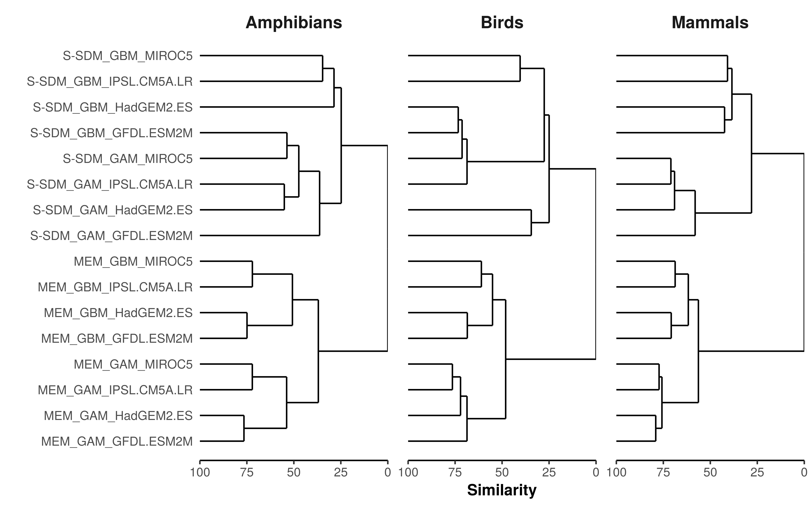

^1^Biodiversity & Global Change Lab, Terrestrial Ecology Research Group, Technical University of Munich, Germany

^2^Senckenberg Biodiversity and Climate Research Centre, Senckenberganlage 25, D-60325 Frankfurt, Germany

^3^Department of Physical Geography, Geosciences, Johann Wolfgang Goethe University of Frankfurt, Altenhöferallee 1, 60438 Frankfurt am Main, Germany

**Correspondence:** Matthias F. Biber, Technical University of Munich, Hans-Carl-von Carlowitz-Platz 2, D-85354 Freising, Germany, E-mail: matthias.biber@tum.de

# Supporting Information

## Supporting Tables

**Table S1.** Calibration regressions (linear model) of MEMs and S-SDMs on EOO-based species richness. Root Mean Square Error (RMSE) of MEMs, Mean (± SD) of Area Under the Curve (AUC) for S-SDMs and Pearson correlation between MEMs and S-SDMs. Perfect fits would have intercepts of 0 and slopes of 1, AUC of 1 or RMSE of 0.

```{r cor_tab_ssdm_mem, results="asis", echo=F, warning=F, message=F}
library(dplyr); library(ModelMetrics)

# Merge predicted and observed richness
sr_observed <- read.csv("data/sr_observed_ssdm.csv.xz")
sr_ssdm <- read.csv("data/sr_predicted_ssdm_1995_dispersal1.csv.xz")
sr_mem <- rbind(read.csv("data/sr_predicted_mem_sub_GAM_poisson_eco_1995.csv.xz"),
                read.csv("data/sr_predicted_mem_sub_GBM_poisson_eco_1995.csv.xz")) %>%
  dplyr::select(x,y,mean,model,taxa)
colnames(sr_mem) <- c("x", "y", "mn", "model", "taxa")
sr_mem$model <- factor(sr_mem$model, labels=c("GAM", "GBM"))
sr_mem_ssdm <- inner_join(sr_ssdm, sr_mem)
colnames(sr_ssdm)[3] <- "mn"
sr_ssdm$type <- "S-SDM"
sr_mem$type <- "MEM"
sr_obs_pred1 <- rbind(inner_join(sr_observed, sr_ssdm), 
                      inner_join(sr_observed, sr_mem)) %>% 
  data.frame()

## Create ensemble mean
ensemble <- sr_obs_pred1 %>% group_by(x,y,model,type,taxa) %>% 
  dplyr::summarise(mn = mean(mn, na.rm=T),
                   sum = mean(sum, na.rm=T)) %>% data.frame()
ensemble$model <- "Ensemble"
sr_obs_pred1 <- rbind(sr_obs_pred1, ensemble); rm(ensemble)
sr_obs_pred1$model <- factor(sr_obs_pred1$model, 
                             levels=c("GAM", "GBM", "Ensemble"))
sr_obs_pred1$taxa <- factor(sr_obs_pred1$taxa, 
                             labels=c("Amphibians", "Birds", "Mammals"))

lm_ssdm <- sr_obs_pred1 %>% filter(type == "S-SDM") %>%
  group_by(taxa, model) %>% 
  do(mod = lm(mn ~ sum, data = .)) %>%
  mutate(Intercept = summary(mod)$coeff[1],
         Slope = summary(mod)$coeff[2],
         R2 = summary(mod)$r.squared) %>%
  dplyr::select(-mod)

## Calculate AUC
AUC <- lapply(c("Amphibian", "Bird", "Mammal"), function(taxa){
  #Read data
  AUC_data <- lapply(c("GAM", "GBM", "MaxEnt", "RF"), function(model_type){
    readr::read_csv(paste0("data/AUCvalues_All_", 
                           model_type, "_", taxa, ".csv.xz"))})
  AUC_data <- do.call(rbind, AUC_data)
  
  #Aggregate the different AUC values from the 10 iterations per species
  #and filter by AUC > 0.7
  AUC_sum <- AUC_data %>% group_by(Species, taxa, model_type) %>% 
    summarise(mn = mean(AUC, na.rm=T)) %>% filter(mn >= 0.7) %>% ungroup() %>% 
    group_by(Species, taxa) %>% mutate(n = n()) %>% 
    filter(n == 4)
  AUC_sum$taxa <- taxa
  return(AUC_sum)
})
AUC <- dplyr::bind_rows(AUC)

ensemble <- AUC %>% filter(model_type %in% c("GAM", "GBM")) %>%
  droplevels %>% group_by(taxa) %>% 
  dplyr::summarise(mnAUC = mean(mn, na.rm=T),
                   std = sd(mn, na.rm=T)) %>% 
  mutate_if(is.numeric, round, digits=2) %>% 
  tidyr::unite(AUC, mnAUC, std, sep=" ± ")
ensemble$taxa <- factor(ensemble$taxa, labels=c("Amphibians", "Birds", "Mammals"))
ensemble$model_type <- "Ensemble"

AUC <- AUC %>% filter(model_type %in% c("GAM","GBM")) %>%
  droplevels %>% group_by(taxa, model_type) %>% 
  summarise(mnAUC=mean(mn,na.rm=T),
            std=sd(mn, na.rm=T)) %>% 
  mutate_if(is.numeric, round, digits=2) %>% 
  tidyr::unite(AUC, mnAUC, std, sep=" ± ")
AUC$taxa <- factor(AUC$taxa, labels=c("Amphibians", "Birds", "Mammals"))
AUC <- bind_rows(AUC, ensemble)
lm_ssdm <- left_join(lm_ssdm, AUC, 
                     by=c("taxa", "model"="model_type"))

# Calculate RMSE
rmse_mem <- sr_obs_pred1 %>% filter(type == "MEM") %>% 
  group_by(taxa, model) %>% summarise(RMSE=ModelMetrics::rmse(sum, mn))

lm_mem <- sr_obs_pred1 %>% filter(type == "MEM") %>%
  group_by(taxa, model) %>% 
  do(mod = lm(mn ~ sum, data = .)) %>%
  mutate(Intercept = summary(mod)$coeff[1],
         Slope = summary(mod)$coeff[2],
         R2 = summary(mod)$r.squared) %>%
  dplyr::select(-mod)
lm_mem <- left_join(lm_mem, rmse_mem)

ensemble <- sr_mem_ssdm %>% group_by(x,y,taxa) %>% 
  dplyr::summarise(mn = mean(mn, na.rm=T),
                   EWEMBI_1995 = mean(EWEMBI_1995, na.rm=T)) %>% data.frame()
ensemble$model <- "Ensemble"
ensemble$taxa <- factor(ensemble$taxa, 
                         labels=c("Amphibians", "Birds", "Mammals"))
sr_cor <- rbind(sr_mem_ssdm, ensemble) %>% group_by(taxa, model) %>% 
  summarise(cor=cor(EWEMBI_1995, mn))

df <- left_join(lm_mem, lm_ssdm, by=c("taxa", "model"))
df$model <- factor(df$model, levels=c("GAM", "GBM", "Ensemble"))
df <- df %>% arrange(model)
df$cor <- sr_cor$cor
colnames(df) <- c("Taxa", "Algorithm", "Interc. MEM", "Slope MEM", 
                  "R2 MEM", "RMSE", "Interc. S-SDM", "Slope S-SDM", 
                  "R2 S-SDM", "AUC", "Cor.")
knitr::kable(df, digits=2, format = "latex", booktabs = TRUE) %>%
  kableExtra::kable_styling(latex_options = "scale_down")
```

\newpage

**Table S2.** Relative contributions to the overall variation in predicted future species richness from different sources of variance for each species coverage class (see Fig. S5). Values represent median proportions (%) of the total sum of squares from the three-way ANOVA performed for each grid cell evaluating the relative contributions of model type, model algorithm and general circulation model (GCM), as well as their interactions to the variance of predicted future species richness for the two different RCPs, separately for each taxon and each species coverage class. Note that the variance determined by the full interaction cannot be differentiated from the residual (unexplained) variance.
  
```{r aov_table_coverage, results="asis", echo=F, warning=F, message=F}
#Proportion of the total sum of squares
aov_out <- read.csv("data/aov_out_speccov_2080.csv.xz") %>% 
  filter(term != "Residuals") %>% 
  select(x,y,taxa,prop,scenario, term, sumsq) %>% 
  group_by(x,y,taxa,prop, scenario) %>% 
  mutate(sum=sum(sumsq))

aov_sum <- aov_out %>% group_by(taxa, prop, scenario, term) %>%
  summarise(SS = round(median(sumsq/sum*100),2)) %>% ungroup %>%
  mutate(term = factor(term, levels=c("model", "type", "gcm", "model:type",
                                 "model:gcm", "type:gcm", "model:type:gcm"),
                       labels=c("Model algorithm", "Model type", "GCM", 
                                 "Algorithm * Type", "Algorithm * GCM", "Type * GCM", 
                                 "Algorithm * Type * GCM")),
         prop = factor(prop, labels=c("0 - 85 %", "85 - 90 %", 
                                      "90 - 95 %", "95 - 100 %"))) %>% 
  tidyr::spread(prop, SS) %>% arrange(taxa, term) %>% mutate_if(is.factor, as.character)

aov_rcp26 <- aov_sum %>% filter(scenario=="rcp26") %>% select(-scenario)
aov_rcp60 <- aov_sum %>% filter(scenario=="rcp60") %>% select(-scenario)
aov_sum2 <- left_join(aov_rcp26, aov_rcp60, by=c("taxa", "term"))
colnames(aov_sum2) <- c("Taxa", "Source", "0 - 85 %", "85 - 90 %", "90 - 95 %", 
                    "95 - 100 %", "0 - 85 %", "85 - 90 %", "90 - 95 %", 
                    "95 - 100 %")
aov_sum2$Taxa <- c("Amphibians", "", "", "", "", "", "",
                   "Birds", "", "", "", "", "", "",
                   "Mammals", "", "", "", "", "", "")
#colnames(aov_sum2) <- c("", "", "RCP2.6", "", "", "", "RCP6.0", "", "", "")
knitr::kable(aov_sum2, digits=2, format = "latex", booktabs = TRUE) %>%
  kableExtra::add_header_above(c(" ", " ", "RCP2.6" = 4, "RCP6.0" = 4)) %>%
  kableExtra::kable_styling(latex_options = "scale_down")
```

\newpage

## Supporting Figures

{width=100%}

**Fig. S1.** Area Under the Curve (AUC) rank of the 10 best variable combinations for a representative subset of species for each of the three taxa using  SDMs (only using Generalized Additive Model (GAM) as model algorithm). AUC ranks were defined for each considered species by ranking the AUC values of the different variable combinations from high to low.

{height=89%}

**Fig. S2.** EOO-based versus predicted species richness per taxon according to ensemble mean (average among model algorithms) of S-SDMs under different dispersal assumptions (No dispersal, d/4, d/2, d, 2*d, Full dispersal). Black lines represent the fit of the respective regression, with the model equation and the R^2^ value given in black as well. Perfect fits would have intercepts of 0, slopes of 1 and a R^2^ value of 1 (dashed grey line).


**Fig. S3.** Current distribution of EOO-based species richness and modelled richness according to ensemble mean (average among model algorithms) of S-SDMs under different dispersal assumptions (no dispersal, d/4, d/2, d, 2*d, full dispersal). Maps are in Mollweide equal-area projection (EPSG:54009), the dashed line denotes the Equator.


**Fig. S4.** Current species richness per taxon derived from (a), (d), (g) EOO range maps and ensemble predictions (average among model algorithms) of (b), (e), (h) MEMs and (c), (f), (i) S-SDMs. S-SDMs were performed assuming a low dispersal (d/4). MEMs were performed using the same species, as for the S-SDMs. Maps are in Mollweide equal-area projection (EPSG:54009), the dashed line denotes the Equator.


**Fig. S5.** (a), (c), (e) Species coverage (%) of each cell separated by the three taxa and (b), (d), (f) the corresponding histograms of the area (ha) covered by species coverage (%). Species coverage was calculated for each taxon by dividing the number of modelled species (S-SDMs and MEMs) in each cell by the EOO species richness of the entire species set. Maps are in Mollweide equal-area projection (EPSG:54009), the dashed line denotes the Equator.


**Fig. S6.** (a), (d), (g) Current species richness derived from ensemble predictions (average among model algorithms) per taxon from MEMs All (entire species set), (b), (e), (h) the percentage difference between MEMs All and MEMs, calculated as MEM All – MEM / MEM * 100, and (c), (f), (i) the corresponding histograms of the area (ha) covered by the percentage difference. Maps are in Mollweide equal-area projection (EPSG:54009), the dashed line denotes the Equator. 


**Fig. S7.** Future species richness per taxon according to ensemble predictions (average among GCMs and model algorithms) of (a), (d), (g) MEMs and (b), (e), (h) S-SDMs and (c), (f), (i) their correlation in 2080 under the RCP6.0 scenario. S-SDMs were performed assuming a low dispersal scenario (d/4). MEMs were performed using the same species, as for the S-SDMs. Maps are in Mollweide equal-area projection (EPSG:54009), the dashed line denotes the Equator. Black lines represent the fit of the respective regression, with the R^2^ value given in black as well. Perfect fits would have a R^2^ value of 1 (dashed line).  


**Fig. S8.** Difference between future species richness ensemble predictions (average among GCMs and model algorithms) of MEMs and S-SDMs (MEM - S-SDM) per taxon in 2080 under the (a), (c), (e) RCP2.6 and (b), (d), (f) RCP6.0 scenario. S-SDMs were performed assuming a basic dispersal scenario (d/4). MEMs were performed using the same species, as for the S-SDMs. Maps are in Mollweide equal-area projection (EPSG:54009), the dashed line denotes the Equator.  

{height=89%}

**Fig. S9.** Correlation between ensemble mean (average among GCMs and model algorithms) of MEMs and S-SDMs predicted future species richness per taxon in 2080 under the RCP2.6 scenario under different dispersal assumptions. Black lines represent the fit of the respective regression, with the model equation and the R^2^ value given in black as well. Perfect fits would have intercepts of 0, slopes of 1 and a R^2^ value of 1 (dashed line).

{height=89%}

**Fig. S10.** Correlation between ensemble mean (average among GCMs and model algorithms) of MEMs and S-SDMs predicted future species richness per taxon in 2080 under the RCP6.0 scenario under different dispersal assumptions. Black lines represent the fit of the respective regression, with the model equation and the R^2^ value given in black as well. Perfect fits would have intercepts of 0, slopes of 1 and a R^2^ value of 1 (dashed line).


**Fig. S11.** Absolute change in species richness per taxon according to ensemble predictions (average among GCMs and model algorithms) of (a), (d), (g) MEMs and (b), (e), (h) S-SDMs and (c), (f), (i) their correlation in 2080 under the RCP2.6 scenario. S-SDMs were performed assuming a low dispersal scenario (d/4) for both current and future time periods. MEMs were performed using the same species, as for the S-SDMs. Maps are in Mollweide equal-area projection (EPSG:54009), the dashed line denotes the Equator. Black lines represent the fit of the respective regression, with the R^2^ value given in black as well. Perfect fits would have a R^2^ value of 1 (dashed line).  


**Fig. S12.** Relative change in species richness per taxon according to ensemble predictions (average among GCMs and model algorithms) of (a), (d), (g) MEMs and (b), (e), (h) S-SDMs and (c), (f), (i) their correlation in 2080 under the RCP2.6 scenario. S-SDMs were performed assuming a low dispersal scenario (d/4) for current and future time periods. MEMs were performed using the same species, as for the S-SDMs. Maps are in Mollweide equal-area projection (EPSG:54009), the dashed line denotes the Equator. Black lines represent the fit of the respective regression, with the R^2^ value given in black as well. Perfect fits would have a R^2^ value of 1 (dashed line).   


**Fig. S13.** Absolute change in species richness per taxon according to ensemble predictions (average among GCMs and model algorithms) of (a), (d), (g) MEMs and (b), (e), (h) S-SDMs and (c), (f), (i) their correlation in 2080 under the RCP6.0 scenario. S-SDMs were performed assuming a low dispersal scenario (d/4) for both current and future time periods. MEMs were performed using the same species, as for the S-SDMs. Maps are in Mollweide equal-area (EPSG:54009), the dashed line denotes the Equator. Black lines represent the fit of the respective regression, with the R^2^ value given in black as well. Perfect fits would have a R^2^ value of 1 (dashed line).  


**Fig. S14.** Relative change in species richness per taxon according to ensemble predictions (average among GCMs and model algorithms) of (a), (d), (g) MEMs and (b), (e), (h) S-SDMs and (c), (f), (i) their correlation in 2080 under the RCP6.0 scenario. S-SDMs were performed assuming a low dispersal scenario (d/4) for current and future time periods. MEMs were performed using the same species, as for the S-SDMs. Maps are in Mollweide equal-area projection (EPSG:54009), the dashed line denotes the Equator. Black lines represent the fit of the respective regression, with the R^2^ value given in black as well. Perfect fits would have a R^2^ value of 1 (dashed line).  


**Fig. S15.** Future species richness per taxon according to ensemble predictions (average among GCMs and model algorithms) of (a), (d), (g) MEMs All (entire species set) and (b), (e), (h) the percentage difference between the MEMs All and MEMs, calculated as MEM All – MEM / MEM * 100, and (c), (f), (i) the corresponding histograms of the area (ha) covered by the percentage difference in 2080 under RCP2.6. Maps are in Mollweide equal-area projection (EPSG:54009), the dashed line denotes the Equator.  


**Fig. S16.** Future species richness per taxon according to ensemble predictions (average among GCMs and model algorithms) of (a), (d), (g) MEMs All (entire species set) and (b), (e), (h) the percentage difference between the MEMs All and MEMs, calculated as MEM All – MEM / MEM * 100, and (c), (f), (i) the corresponding histograms of the area (ha) covered by the percentage difference in 2080 under RCP6.0. Maps are in Mollweide equal-area projection (EPSG:54009), the dashed line denotes the Equator.  



**Fig. S17.** Dendrogram of hierarchical cluster analysis of the future species richness estimates for the 16 combinations of model type (S-SDM, MEM), model algorithm (GAM, GBM) and general circulation model (MIROC5, IPSL.CM5A.LR, HadGEM2.ESM GFDL.ESM2M) for each taxon under the RCP6.0 scenario.  

\newpage


**Fig. S18.** Proportion of the total sum of squares among the three taxa accounted for by the interactions between model algorithm, model type and general circulation model (GCM) under the RCP2.6 scenario. Maps are in Mollweide equal-area projection (EPSG:54009), the dashed line denotes the Equator.  

\newpage


**Fig. S19.** Proportion of the total sum of squares among the three taxa accounted for by model algorithm, model type and general circulation model (GCM) under the RCP6.0 scenario. Maps are in Mollweide equal-area projection (EPSG:54009), the dashed line denotes the Equator.  

\newpage


**Fig. S20.** Proportion of the total sum of squares among the three taxa accounted for by the interactions between model algorithm, model type and general circulation model (GCM) under the RCP6.0 scenario. Maps are in Mollweide equal-area projection (EPSG:54009), the dashed line denotes the Equator.  


**Fig. S21.** Dendrogram of hierarchical cluster analysis of the future species richness estimates for the 16 combinations of model type (S-SDM, MEM), model algorithm (GAM, GBM) and general circulation model (MIROC5, IPSL.CM5A.LR, HadGEM2.ESM GFDL.ESM2M) for each taxon and each species coverage class (see Fig. S5) under the RCP2.6 scenario.  


**Fig. S22.** Dendrogram of hierarchical cluster analysis of the future species richness estimates for the 16 combinations of model type (S-SDM, MEM), model algorithm (GAM, GBM) and general circulation model (MIROC5, IPSL.CM5A.LR, HadGEM2.ESM GFDL.ESM2M) for each taxon and each species coverage class (see Fig. S5) under the RCP6.0 scenario.  
